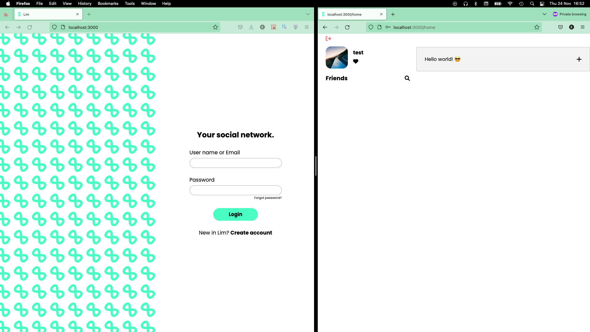
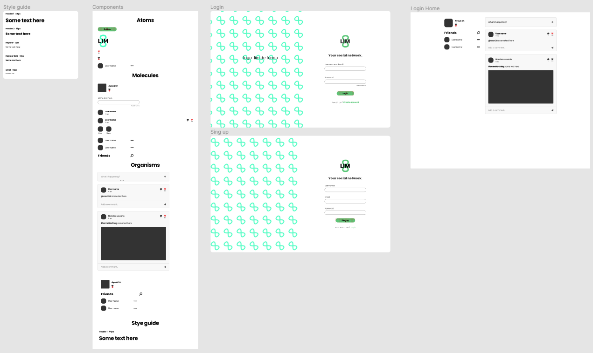

# Lim project

Lim is a social network build with GraphQL, Nextjs, MongoDB, and React.

[demo](https://youtu.be/WdJOcVGNUlM)

**Figma**

[Figma design system](https://www.figma.com/file/YpF9wNxntTvVpzt4XxWW2t/lim-project-team-library?node-id=411%3A2&t=ERGX1WjE3bo5ZEVw-1)

**Database diagram**

### Technologies
Front-end
  - React
  - Apollo
  - NextJS
  - Jest 
  - StoryBook

Back-end
  - MongoDb
  - GraphQL
  - Jest 
  - Json Web Token
  - Bycrpt

Tools
  - Figma
  - Husky
  - Commitlint
  - Eslint
  - Prettier
